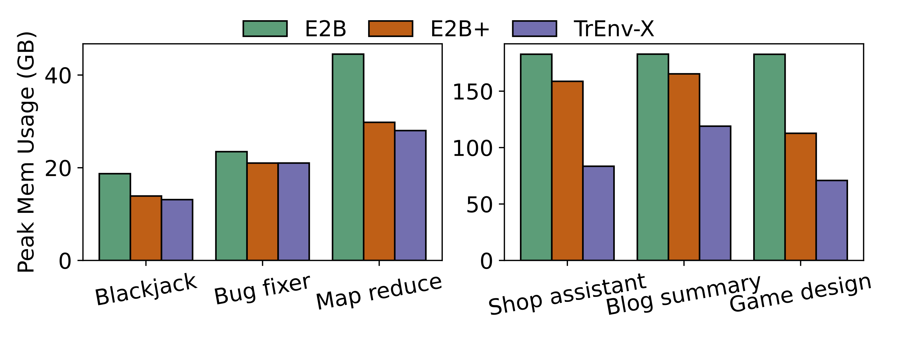
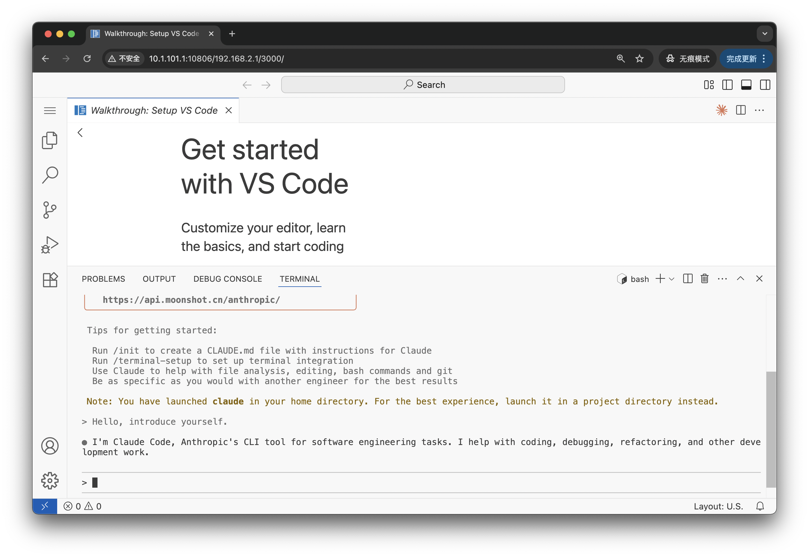

<h2 align="center">
  TrEnv-X
</h2>

<h3 align="center">
  Run AI Code in A Secure and Efficient Environment.
</h3>

TrENV-X is an open-source runtime platform designed for AI Agent applications. It addresses the unique challenges of running Agent workloads, such as irregular traffic patterns, by delivering exceptional elasticity, high density, and strong isolation.

## Why TrEnv-X

Modern AI Agents interact with tools (browsers, code interpreters, etc.) and LLMs, requiring a flexible and efficient execution environment. Traditional FaaS solutions often lead to high costs and inefficient resource usage for these tasks.

TrEnv-X provides:

- Strong isolation: using virtual machine to safely run untrusted Agent code.

- Fast scaling: using snapshotting for millisecond-level startup latency. The sandbox can be **started < 40 ms**.

- High density: via memory sharing techniques. Achieve **up to 61% memory reduction** compared with firecracker-based platforms ([E2B](https://e2b.dev/)), enabling higher deployment density.

- Easy to use: define your sandbox environment/rootfs based on Dockerfile.

- Adoption of two mainstream VMMs: Cloud Hypervisor and Firecracker.



TrEnv-X enables you to run AI agent in an isolated VM (sandbox). After deploying the TrEnv-X, you can interact with sandbox using the [Python SDK](./sandbox-sdk).

For more technical details, you can refer to the paper [TrEnv: Transparently Share Serverless Execution Environments Across Different Functions and Nodes](https://arxiv.org/abs/2509.09525).

## Installation

Currently, the TrEnv-X backend only able to deploy on Linux. Make sure you have enable kvm (check /dev/kvm exists).
To install the TrEnv-X backend, you need the following prerequisite software:

- [golang](https://go.dev/doc/install) >= 1.23
- docker

Then start compiling the binary of backend

```bash
git clone https://github.com/kvcache-ai/TrEnv-X.git
cd TrEnv-X
pushd scripts
./start.sh setup
popd

# install python sdk
curl -sSL https://install.python-poetry.org | python3 -
pushd sandbox-sdk
make install
popd
```

## Quick Start

There are two steps needed to deploy your TrEnv-X sandbox, the first is to create the template, the second is to start (multiple) instances of that template.

### Create the template

You need to define the template via the toml file, an example can be found at [packages/example_config.toml](./packages/example_config.toml).

Then you can use `template-manager` to build the template:

```bash
pushd packages/template-manager && ./bin/template-manager --config ../example_config.toml && popd
```

Internally, the template-manager will create the block storage and generate a snapshot of the VM.

### Start the sandbox

The let's start the sandbox from the template. First, we need to start the TrEnv-X backend.

Currently, TrEnv-X backend aims at running on single machine.

```bash
pushd scripts && bash start.sh run
```

Now, we can start a sandbox using either the Python SDK or the command line tool.
(Note that we can start multiple sandboxes of the same template).

```python
import asyncio
from sandbox_sdk.sandbox import Sandbox

async def main():
  template = "default-fc"
  ci = await Sandbox.create(
      template=template,
      # replace this with your machine's (that execute start.sh run) ip address
      target_addr="127.0.0.1",
  )
  p = await ci.process.start("python -c \"print('Hello World')\"")
  await p.wait()
  print(p.stdout)


asyncio.run(main())
```

```bash
cd packages/cli
# if use cli on the same machine as backend
./bin/sandbox-cli sandbox create -t default-sandbox
# if on different machine
./bin/sandbox-cli sandbox --ip <ip_of_backend_machine> create -t default-sandbox

# example output:
# e7ca4748-f159-4c97-beb2-398a9e5487f1

# To list all running sandbox:
./bin/sandbox-cli sandbox ls -a
# ./bin/sandbox-cli sandbox -i <ip_of_backend_machine> ls -a

# On the backend machine, you can login to the sandbox
# assume the sandbox id is e7ca4748-f159-4c97-beb2-398a9e5487f1
# you can ssh into the sandbox
ssh root@e7ca4748-f159-4c97-beb2-398a9e5487f1
```


## Customize template - Claude Code
To customize the template, you need to prepare two things:

- A customized docker image.
- Add a new entry under the `template` in the config toml.

For example, as in the [packages/example_config.toml](./packages/example_config.toml), you just need to add another template entry, for example:

```
[template."claude-code"]
vcpu = 2
mem_mb = 4096
disk_mb = 4096
kernel_version = "fc-6.1.134"
docker_img = "jialianghuang/claude-code:latest"
# Whether to pull the docker image from registry
# Set to true will use local images.
no_pull = false
huge_pages = false
overlay = false
vmm_type = "firecracker"
start_cmd.cmd = "/home/user/claude-setup.sh"
```

Note that toml support to write comments (start with `#`) and you can write multiple template configurations using different entries in one toml file.

When building the new template, DO NOT FORGET to **update the `template_id` in the `template_manager`** of config toml, and execute:

```bash
cd sandbox-backend/packages/template-manager && ./bin/template-manager --config ../example_config.toml
```

Then you can start the new template "claude-code" using our SDK as following:

```bash
# Activate the poetry (or python environment that install sdk)
cd TrEnv-X/sandbox-sdk && eval $(poetry env activate)

# Set the SANDBOX_BACKEND_ADDR to your TrEnv-X backend's ip
# Set the ANTHROPIC_API_KEY
# If you want to use kimi public API, then set --kimi. By default, use anthropic.
SANDBOX_BACKEND_ADDR=127.0.0.1 claude-coder --kimi --api-key $ANTHROPIC_API_KEY
```

It will print the url on the terminal. You can paste it to open in the browser. In the browser, there will be an online vscode editor, you can start type `claude` in the online vscode's terminal.




## NOTES about performance

### Startup

Here are some notes to make startup more efficient:

- Make sure `data_root` in your toml config support reflink (e.g., xfs), while ext4 not support this.
If reflink not supported at `data_root`, it will copy the template image every time when it starts a sandbox. This will make startup slow.

### Memory

- To achieve the best density/memory utilization, use Cloud Hypervisor to make sandbox use page cache more efficiently. Cloud Hypervisor supports virtio-pmem that can bypass the guest page cache.
- Use our [customized Cloud Hypervisor](https://github.com/X-code-interpreter/cloud-hypervisor), to achieve efficient startup latency, as the original Cloud Hypervisor needs data copy during restoring.

## Reference

The initial paper on SOSP:
```
@inproceedings{10.1145/3694715.3695967,
author = {Huang, Jialiang and Zhang, MingXing and Ma, Teng and Liu, Zheng and Lin, Sixing and Chen, Kang and Jiang, Jinlei and Liao, Xia and Shan, Yingdi and Zhang, Ning and Lu, Mengting and Ma, Tao and Gong, Haifeng and Wu, YongWei},
title = {TrEnv: Transparently Share Serverless Execution Environments Across Different Functions and Nodes},
year = {2024},
isbn = {9798400712517},
publisher = {Association for Computing Machinery},
address = {New York, NY, USA},
url = {https://doi.org/10.1145/3694715.3695967},
doi = {10.1145/3694715.3695967},
booktitle = {Proceedings of the ACM SIGOPS 30th Symposium on Operating Systems Principles},
pages = {421–437},
numpages = {17},
keywords = {serverless, cold start, CXL, remote memory},
location = {Austin, TX, USA},
series = {SOSP '24}
}
```

The extended version with adaption on AI agents:
```
@misc{huang2025trenvtransparentlyshareserverless,
      title={TrEnv: Transparently Share Serverless Execution Environments Across Different Functions and Nodes}, 
      author={Jialiang Huang and Teng Ma and Zheng Liu and Sixing Lin and Kang Chen and Jinlei Jiang and Xia Liao and Yingdi Shan and Yongwei Wu and Ning Zhang and Mengting Lu and Tao Ma and Haifeng Gong and Mingxing Zhang},
      year={2025},
      eprint={2509.09525},
      archivePrefix={arXiv},
      primaryClass={cs.DC},
      url={https://arxiv.org/abs/2509.09525}, 
}
```

## Acknowledgement
This project partially refers to [E2B](https://e2b.dev/).
